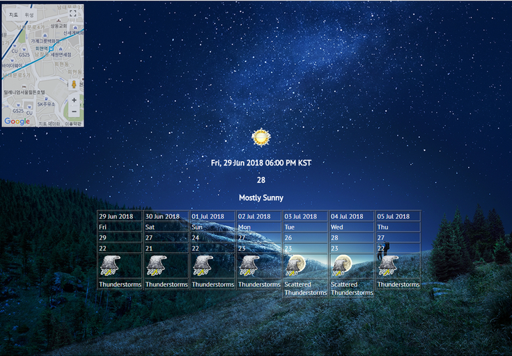

# Weather
AJAX를 이용한 날씨와 구글맵을 볼 수 있는 페이지

## 프로젝트 소개
AJAX를 이용하여 버튼을 누르면 자신의 현재 위치를 구글맵을 통해 나타내며, 버튼을 누른 당시부터 일주일간의 날씨를
구글 날씨를 통해 보여주게 만든 페이지 입니다. AJAX가 무엇인지 그리고 이를 사용하면 어떤점이 편리한지 배우며
웹페이지 제작에 더욱 익숙해지고자 진행한 프로젝트였습니다.

## 작업 환경
- 언어 : HTML, CSS
- 개발도구 : 이클립스
- 운영체제 : Windows
- 형상관리 : git, github

## 구현 화면

